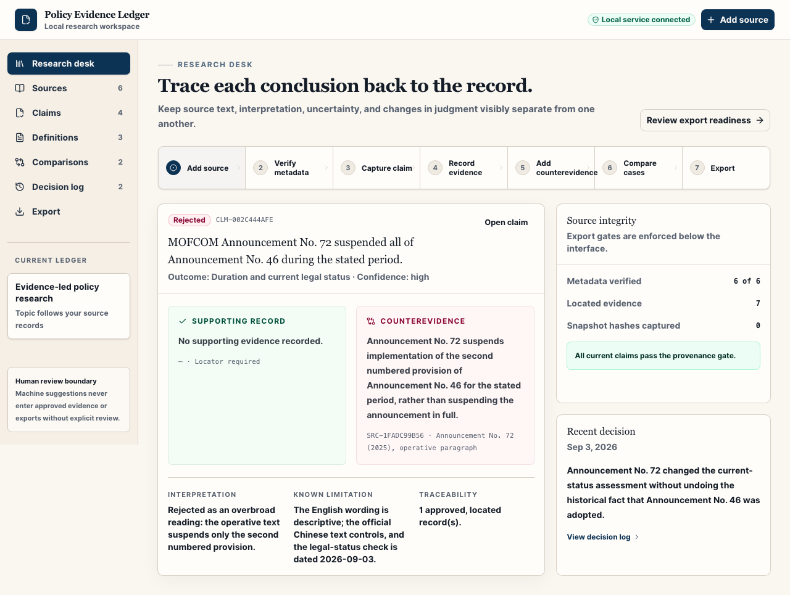
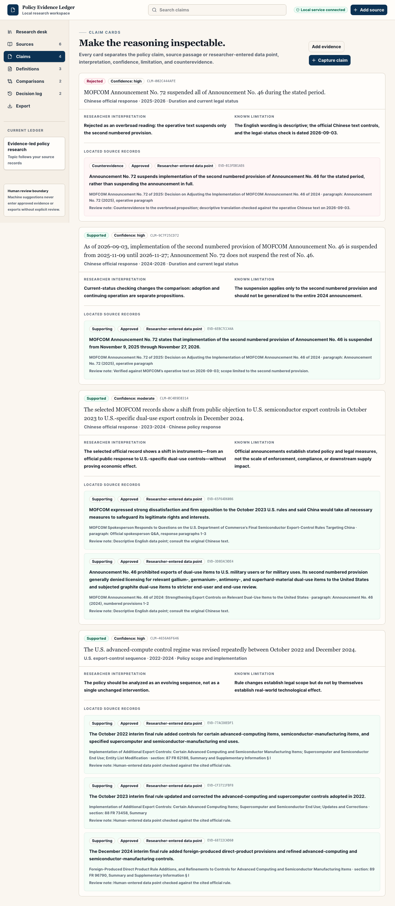
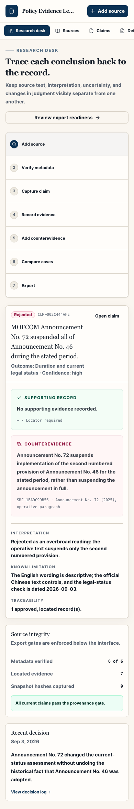

# Policy Evidence Ledger

## Description

A local-first research workspace that makes every exportable policy claim traceable to a verified source and precise locator. It records evidence, counterevidence, changing definitions, contradictions, uncertainty, and research decisions without presenting generated prose as evidence.

## Workflow

`ADD SOURCE → VERIFY METADATA → CAPTURE CLAIM → RECORD EVIDENCE → ADD COUNTEREVIDENCE → COMPARE CASES → EXPORT RESEARCH OUTPUT`

## Screenshots

## Current capabilities

- Public URL, PDF/HTML/text upload, and manual-citation ingestion
- SHA-256 source snapshots, deduplication, aliases, and changed-URL versioning
- Metadata verification and human-reviewed source locators
- Structured claims with interpretation, confidence, limitation, status, and counterevidence
- Versioned working definitions
- Case comparison and contradiction relationships
- Research-decision log
- Fail-closed Markdown/CSV/ZIP exports with output hashes
- Public official demonstration corpus
- Keyboard, responsive, and automated accessibility checks
- No API key, paid service, or model call

The bundled demonstration uses six selected official GovInfo and MOFCOM records, rechecked on September 3, 2026. Its current-status example records that MOFCOM Announcement No. 72 suspends only the second numbered provision of Announcement No. 46 through November 27, 2026—not Announcement No. 46 in full.

## Current limitations

- Metadata verification and evidence extraction are manual.
- The app preserves source files but does not render, OCR, or search their full text.
- Bibliography output is not yet CSL/Zotero compatible.
- There is no account system, collaboration, sync, or cloud backup.
- Case comparison is pairwise; the MVP does not model cases as standalone entities.
- The hosted public preview is read-only; private working data remains in the local Python application.

## Links

- Public demo: [policy-evidence-ledger.moaydghazzawi.com](https://policy-evidence-ledger.moaydghazzawi.com/)
- Source repository: [github.com/moaydghazzawi/policy-evidence-ledger](https://github.com/moaydghazzawi/policy-evidence-ledger)
- Future portfolio entry: [moaydghazzawi.com](https://moaydghazzawi.com/) — add a dedicated case study when the broader portfolio is next updated.
